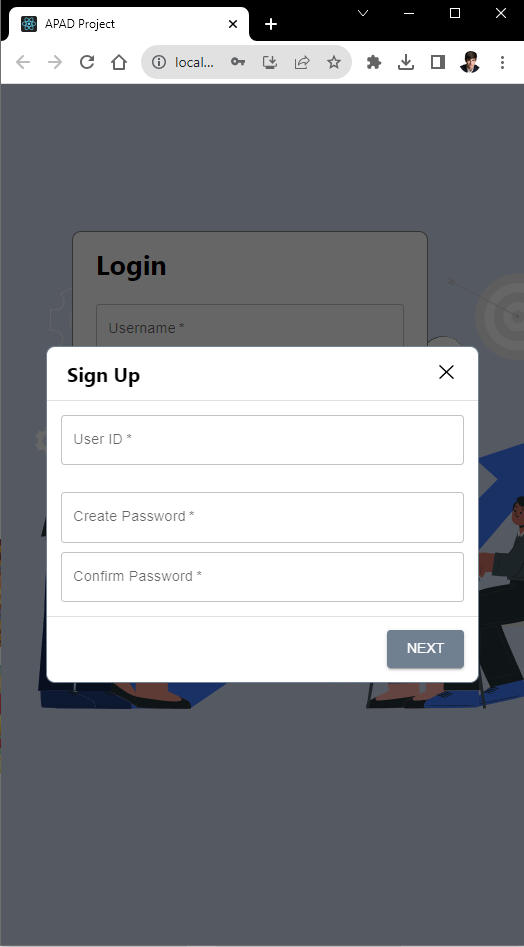
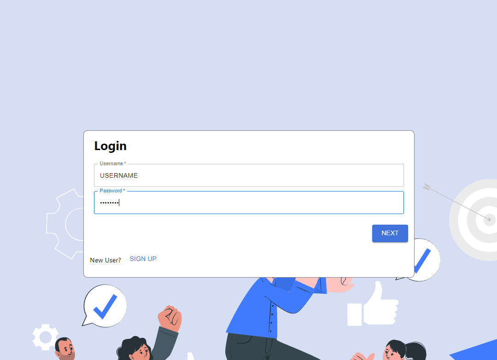
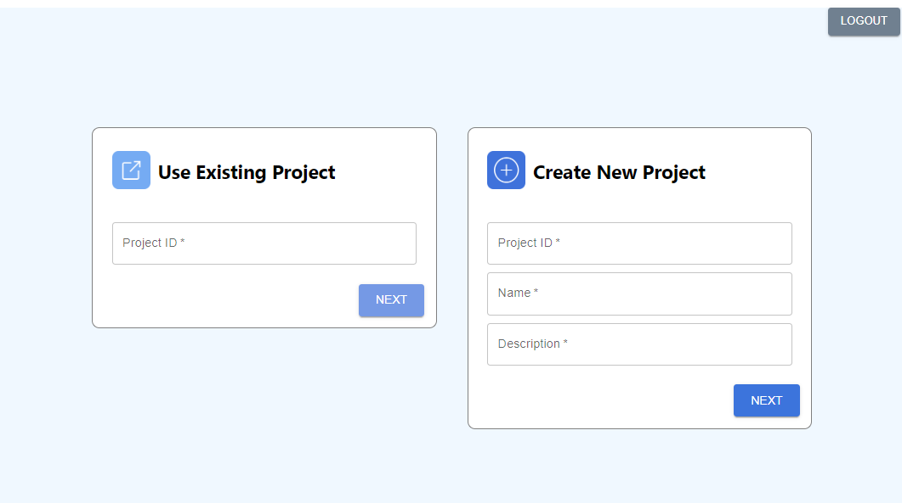
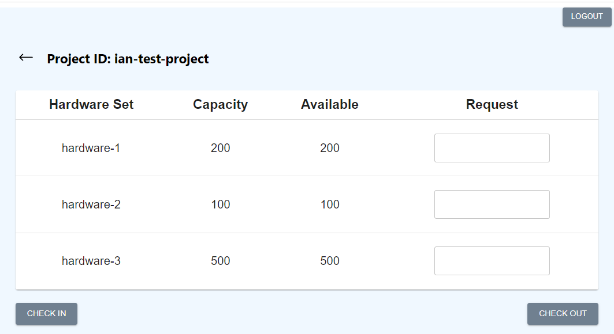
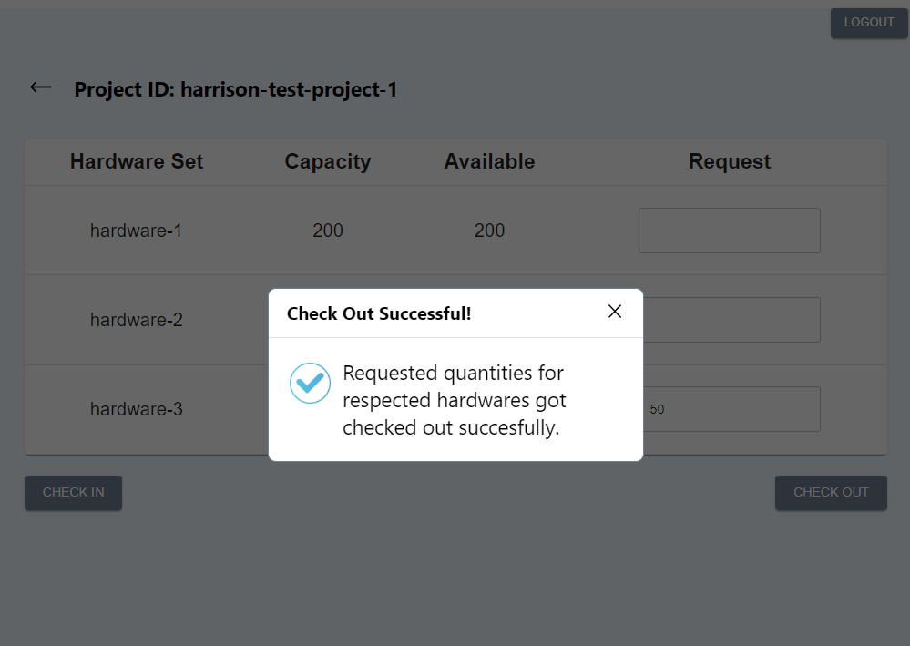
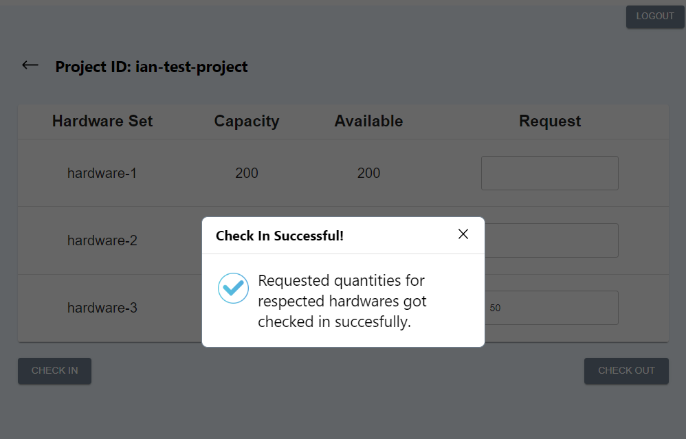

<h1 align="center">

 APAD-HaaS-Project
</h1>
<h3>◦ University of Texas MSITM Advanced Programming & App Development (APAD) class project</h3>
<h3>◦ Full CRUD Hardware-as-a-Service (HaaS) application
<h3>◦ Developed with the software and tools listed below</h3>

## 📒 Table of Contents
- [📍 Overview](#overview)
- [🌐 Latest Deployments](#️latest-deployments)
- [📝 End User Documentation](#user-docs)
- [⚙️ Developer Documentation](#dev-docs)
- [✉️ Contact Us](#contact)

## 📍 Overview

<!-- 

    
    <h1>APAD-HaaS-Project</h1>

 -->

This team project, in our Advanced Programming &amp; App Development (APAD) class at the University of Texas at Austin, involves the creation of a comprehensive Hardware-as-a-Service (HaaS) system featuring both a backend and frontend. 

* The backend, a RESTful API, allows for account management, project creation and access, and resource viewing, requesting, and management. It is developed using Flask and MongoDB, with secure routes protected by JSON Web Tokens (JWT).

* The frontend is built with React and styled with Material-UI. This frontend communicates with the backend API to provide users with an intuitive interface for managing their hardware resources.

The combined system provides a robust platform for managing theoretical hardware resources in a shared environment, with a focus on security, usability, and efficiency.

## 🌐 Latest Deployments

* **Frontend Website**: https://apad-project-frontend.vercel.app
* **Backend API Endpoint:** https://apad-project-backend-22fdec946e0a.herokuapp.com/

## 📝 End User Documentation

The following documentation will walk you through the end user process flow of using the application. 

1. **Create an account** by clicking the **SIGN UP** button on the login page. You will see the following popup:

    

2. **Enter your desired information** and click **NEXT**. You will then receive a success message and be redirected back to the login page. 

    

    * From here you can login with your new credentials, and click **NEXT**. 
    * You should now be redirected to the **project dashboard** page.

3. At this point, you can either **create a new project** or **use an existing project**. Both methods direct you to the corresponding project page where you can view hardware sets and manage resources. 

    

    1. If you'd like to _access an existing project_ and manage the hardware resources, you can do so by entering the **Project ID** and clicking **NEXT** in the **Use Existing Project** card.

    2. If you'd like to _create a new project_ and manage the hardware resources, you can do so by entering the **Project ID**, **Name**, and **Description**, and clicking **NEXT** in the **Create New Project** card.

4. Once on the project page corresponding to the Project ID that you either entered or created, you can view the hardware sets and manage the resources. 

    

    1. To **check out hardware resources** for this project, enter your desired check-out amount into the **Request** column input corresponding to your desired hardware set, and then click **CHECKOUT** on the bottom _right_. You will receive a success message if the hardware was available, and the hardware set will be updated accordingly:

        

    1. To **check in hardware resources** for this project, enter your desired check-in amount into the **Request** column input corresponding to your desired hardware set, and then click **CHECK IN** on the bottom _left_. You will receive a success message if the hardware was available, and the hardware set will be updated accordingly:

        

## ⚙️ Developer Documentation

### Deployments & Projects:

* **Frontend Project**: https://vercel.com/hschickdevs/apad-project-frontend
    - Site URL: https://apad-project-frontend.vercel.app
* **Backend Project:** https://dashboard.heroku.com/apps/apad-project-backend
    - Backend Endpoint: https://apad-project-backend-22fdec946e0a.herokuapp.com/
* **MongoDB Atlas DB:** https://cloud.mongodb.com/v2/64b732579ef0cd4b589d5bef#/metrics/replicaSet/64b9a9da44cff528a871be85/explorer/project-database

### Local Deployment Instructions:

1. Clone the repository: `git clone https://github.com/hschickdevs/APAD-HaaS-Project.git`

2. cd into the project directory: `cd APAD-HaaS-Project`

2. Install the backend dependencies and run app (_Python 3.10+ required_):

    1. cd into the backend directory: `cd backend`

    2. Install the dependencies: `pip install -r requirements.txt`

    3. Run the app: `flask`

3. Install the frontend dependencies and run app (_npm required_):

    1. cd into the frontend directory: `cd frontend`

    2. Install the dependencies: `npm install`

    3. Run the app: `npm start`

### Backend Cloud Deployment Instructions:

1. Create a new app on Heroku

2. Under **Deploy** tab, select **GitHub** as the deployment method and connect to the repository

3. Go to the **Settings** tab, and add the following buildpacks:

    * https://github.com/timanovsky/subdir-heroku-buildpack.git 
        
        - make sure that it is at the top

    * heroku/python 
    
        - Select 'python' under the officially supported buildpacks

4. Next to **Config Vars**, click _Reveal Config Vars_ and add the following variable:

    * `PROJECT_PATH` = `backend`
    * `JWT_SECRET_KEY` = `<RANDOM_SECRET_KEY_FOR_PWD_HASHING>`
    * `MONGO_DB_URI` = `<MONGO_DB_ATLAS_URL>`

5. Return to the **Deploy** tab 

6. Click on **Enable Automatic Deploys** for CI/CD

7. Click **Deploy Branch** under **Manual Deploy**

    * Make sure that the branch is `main`

8. If the build succeeds, you can find the resulting URL next to **Settings** -> **Domains**

### Frontend Cloud Deployment Instructions:

1. Create a new project on https://vercel.com/

2. Connect the project to the GitHub repository

3. In the Vercel project **Settings** tab, set the **Root Directory** to `frontend`

4. Deploy the project

## ✉️ Contact Us

* **Harrison Schick** - [harrison.schick@utexas.edu](mailto:harrison.schick@utexas.edu)
* **Arnav Vats** - [arnav.vats@utexas.edu](mailto:harrison.schick@utexas.edu)
* **Ian Jenatz** - [ian.jenatz@utexas.edu](mailto:harrison.schick@utexas.edu)
* **Aditi Sharma** - [aditi.sharma@utexas.edu](mailto:harrison.schick@utexas.edu)
* **Samridhi Sehgal** - [samridhi.sehgal@utexas.edu](mailto:harrison.schick@utexas.edu)